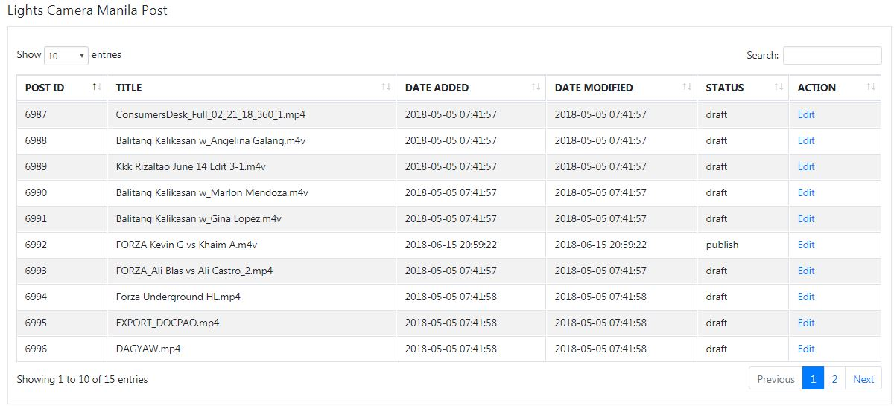

# lcm-post-plugin
Lights Camera Manila Plugin. GET a data from other database and POST to wordpress database.

This is a wordpress plugin connecting with other database.

# Plugin function.
This plugin will GET every new added data from media_db and directly insert the post to the wordpress.

This is the screeshot of the plugin after getting data from other database.

The default status of the inserted POST is "draft", you can edit and change status of your post before you publish it. 
